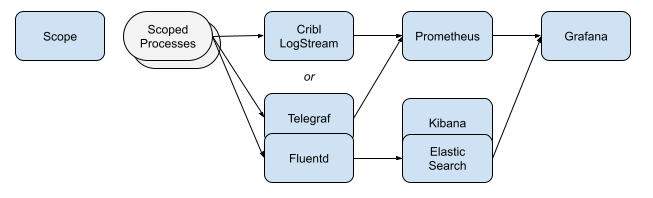

# AppScope Kubernetes Demo

This demo environment uses [AppScope](https://appscope.dev/) to instrument containers running in a demo environment. AppScope provides black box instrumentation that can help you collect performance information and logs from any running Linux process, no matter the runtime. The `scope` CLI makes installing AppScope in Kubernetes as simple as a single command. AppScope installs a [mututating admission webhook](https://kubernetes.io/docs/reference/access-authn-authz/extensible-admission-controllers/) that automatically scopes any new container starting up in a namespace with the label `scope=enabled`. Read more about AppScope in our docs [here](https://appscope.dev/docs/overview), and read more about the Kubernetes feature here (coming).

## Overview

The diagram below depicts the demo cluster. The Scope pod is started first and runs `scope k8s --server` to provide the webhook called when other pods are added. The other pods are then added and configured to connect inputs and outputs as shown. Run `./start.sh` to start with LogStream or `./start.sh oss` to start with Telegraf/Fluentd instead. Scoped processes will be configured to send events and metrics to whichever was used. Ports to access the web interfaces for the containers are exposed to allow access to LogStream, Prometheus, Elasticsearch, Kibana, and Grafana. 



Processes run in additional pods will be scoped unless the `appscope.dev/disable` annotation is set.

## Prerequisites
For this demo environment, you will need Docker, `bash`, and a few Kubernetes utilties: `kubectl`, `kind` and `helm`. `start.sh` uses `kind` to create a Kubernetes environment running in Docker, then we use `kubectl` and `helm` to install Elasticsearch, Kibana, Prometheus, and Grafana. By default, AppScope will send to Fluentd and Telegraf which will send to Elasticsearch and be scraped by Prometheus, or, you can send the data to Cribl LogStream instead, where we will also do some reshaping of the data in LogStream to make it easy to route it anywhere and to help control volume.

Here are installation instructions for `kubectl`, `kind`, and `helm`:

### MacOS
For MacOS, we recommend [Homebrew](https://brew.sh) to make installing these utilities simple.
```bash
brew install kind
brew install kubectl
brew install helm
```

Please also make sure you have sufficient memory for Docker, see [Resources](https://docs.docker.com/docker-for-mac/#resources) for how to increase.

### Linux
```bash
curl -LO https://storage.googleapis.com/kubernetes-release/release/$(curl -s https://storage.googleapis.com/kubernetes-release/release/stable.txt)/bin/linux/amd64/kubectl \
&& sudo install kubectl /usr/local/bin && rm kubectl
curl https://raw.githubusercontent.com/helm/helm/master/scripts/get-helm-3 | bash
curl -Lo ./kind https://kind.sigs.k8s.io/dl/v0.10.0/kind-linux-amd64 && sudo install kind /usr/local/bin && rm ./kind
```

## Running the Demo

To run the demo, simply run `start.sh`:

```bash
./start.sh
```

This will stand up Elasticsearch, Kibana, Grafana, Prometheus, Fluentd and Telegraf, all scoped, in Kubernetes. The demo automatically instruments those applications, feeding itself data from scoping itself. How meta! Inside the environment, there are dashboards in Grafana and Kibana that help you see the type of data we collect with AppScope. 

|Service|URL|
|-------|---|
|Grafana|[http://localhost:30003](http://localhost:30003)|
|Kibana|[http://localhost:30001](http://localhost:30001)|
|Prometheus|[http://localhost:30002](http://localhost:30002)|
|LogStream|[http://localhost:30004](http://localhost:30004)|

Check out the AppScope dashboards in Grafana and Kibana!

For Grafana's login credential, see `grafana.values.yml`

## Clean up

To clean up the demo, simply run `stop.sh`:

```bash
./stop.sh
```

## How it Works

* The `scope k8s` command (without the `--server` option) outputs YAML suitable for piping into `kubectl apply`. This is how we create the Scope pod and configure the mutating webhook. Once that's in place we set `scope=enabled` in the default namespace and we're ready to proceed with adding other pods.
* The webhook is called when containers are added in pods that **don't** have the `appscope.dev/disable` annotation. It creates and populates a volume that is mounted at `/scope` in the containers. It contains the extracted AppScope programs an library along with a `scope.yml` config the directs outputs to either the LogStream or Telegraf/Fluentd pods. It sets some environment variables too.
* Local container images can be sideloaded from the local Docker registry into the cluster using `kind load docker-image $IMAGE --name scope-k8s-demo`. Handy when working with a custom image not available at Docker Hub.


